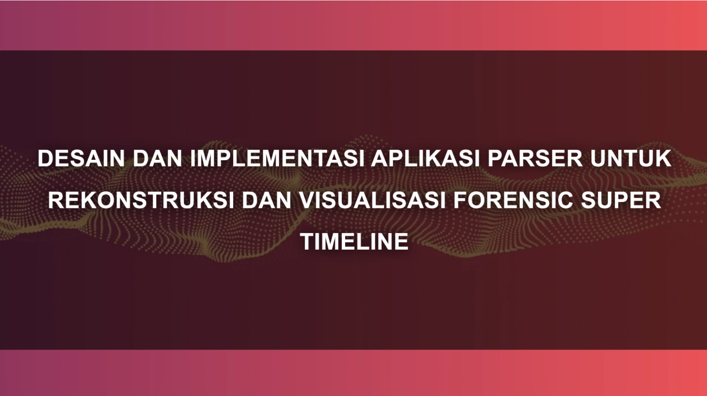

# 🏁 Tugas Akhir (TA) - Final Project

**Nama Mahasiswa**: Christopher Clement Wijaya  
**NRP**: 5025211155  
**Judul TA**: Desain dan Implementasi Aplikasi Parser untuk Rekonstruksi dan Visualisasi Forensic Super Timeline  
**Dosen Pembimbing**: Hudan Studiawan, S.Kom., M.Kom., Ph.D.  
**Dosen Ko-pembimbing**: Dr. Baskoro Adi P., S.Kom.,M.Kom.

---

## 📺 Demo Aplikasi  
[](https://youtu.be/nQEIsi2pZXM)  
*Klik gambar di atas untuk menonton demo*

---

## 🛠 Panduan Instalasi & Menjalankan Software  

### Prasyarat  
- Daftar dependensi (contoh):
  - Python 3.12+ (Sebaiknya dalam virtual environment seperti anaconda karena instruksi instalasi dftpl dalam anaconda)
  - Pip
  - Node.js v22.13.0+   
  - dftpl (branch "python-analyzers", gunakan "main" jika branch "python-analyzers" sudah dimerge ke dalam "main")

### Langkah-langkah  
1. **Clone Repository**  
   ```bash
   git clone https://github.com/Informatics-ITS/ta-5025211155.git
   ```
2. **Instalasi Dependensi**
   ```bash
   cd [folder-proyek]
   pip install -r requirements.txt
   npm install
   ```
3. **Buat folder tambahan dalam root folder sesuai `config.py`. Ubah nama dalam `config.py` sesuai kebutuhan.**
   - Folder "dist" untuk file hasil vite.
   - Folder "app/temp" untuk menyimpan sementara file chunked upload.
   - Folder "app/projects" untuk menyimpan file pengguna.
4. **Bangun file .vue menggunakan vite**  
   `Set-ExecutionPolicy` dipanggil agar bisa menjalankan perintah `npm`
   ```
   Set-ExecutionPolicy Unrestricted -Scope Process 
   npx vite build
   ```
5. **Inisialisasi database user account**
   ```
   [Insert python.exe path here] -m flask db upgrade
   ```
5. Buka browser dan kunjungi: `http://127.0.0.1:5000`

---

## 📚 Dokumentasi Tambahan

- [![Dokumentasi API]](docs/API.pdf)
- [![Diagram Arsitektur]](docs/architecture.png)
- [![Struktur Basis Data]](docs/database_schema.sql)

---

## ✅ Validasi

Pastikan proyek memenuhi kriteria berikut sebelum submit:
- Source code dapat di-build/run tanpa error
- Video demo jelas menampilkan fitur utama
- README lengkap dan terupdate
- Tidak ada data sensitif (password, API key) yang ter-expose

---

## ⁉️ Pertanyaan?

Hubungi:
- Penulis: [christopher.clement.true@outlook.com]
- Pembimbing Utama: [hudan@its.ac.id]
